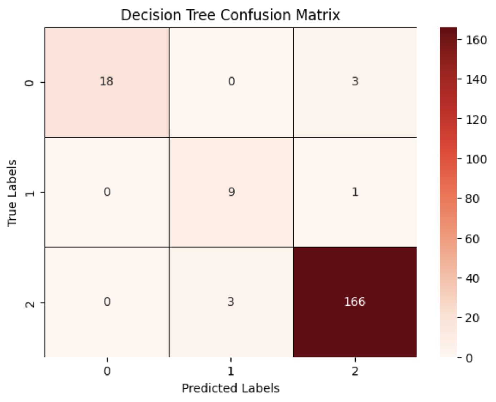
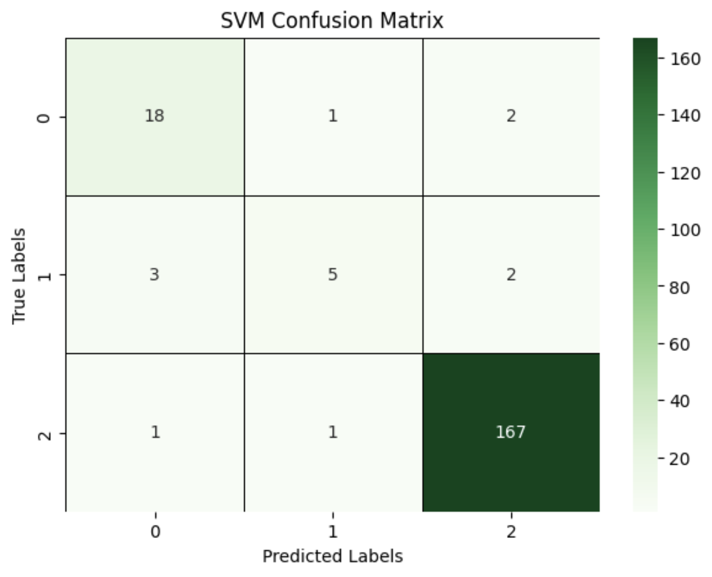
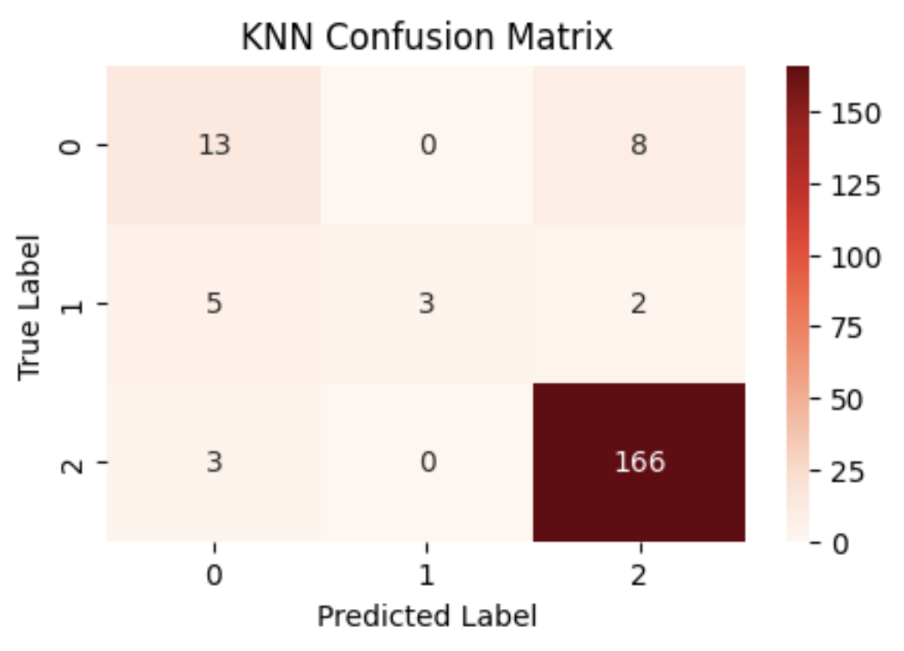

# Diabetes Risk Prediction using Machine Learning

Multi-class classification model for early diabetes detection using medical biomarkers and supervised machine learning algorithms.

---

## Project Overview

This project focuses on early diabetes detection using supervised machine learning techniques. The goal is to classify patients into three categories:

* Non-Diabetic
* Pre-Diabetic
* Diabetic

Machine learning models were trained using medical and demographic features to support faster and more efficient screening.

---

## Dataset Features

The dataset includes the following medical attributes:

* Gender
* Age
* BMI
* Urea
* Creatinine
* HbA1c
* Cholesterol
* Triglycerides (TG)
* HDL
* LDL
* VLDL

Target labels:

* N = Non-Diabetic
* P = Pre-Diabetic
* Y = Diabetic

---

## Technologies Used

* Python
* NumPy
* Pandas
* Scikit-learn
* Matplotlib
* Seaborn
* Jupyter Notebook

---

## Machine Learning Models

The following supervised learning models were implemented:

* Support Vector Machine (SVM)
* Decision Tree
* K-Nearest Neighbors (KNN)

---

## Model Performance Comparison

| Model         | Accuracy | Notes                            |
| ------------- | -------- | -------------------------------- |
| Decision Tree | 0.965    | Best overall performance         |
| SVM           | 0.95     | Stable and strong classification |
| KNN           | 0.91     | Baseline model                   |

---

## Best Performing Model

The Decision Tree model achieved the highest performance with:

* Accuracy: 96.5%
* Balanced classification across all classes
* Strong precision, recall, and F1-score

---

## Evaluation Metrics

The models were evaluated using:

* Accuracy
* Precision
* Recall
* F1-score
* Confusion Matrix
* Classification Report

---

## Confusion Matrices

### Decision Tree


### SVM


### KNN


---

## Workflow

1. Data Loading
2. Data Cleaning
3. Feature Encoding
4. Train/Test Split
5. Feature Scaling
6. Model Training
7. Hyperparameter Tuning
8. Model Evaluation
9. Performance Comparison

---

## Project Structure

```text
diabetes-risk-prediction-ml
├── data
│   └── diabetes_dataset.csv
├── images
│   ├── dt.png
│   ├── svm.png
│   └── knn.png
├── notebooks
│   └── diabetes_risk_prediction.ipynb
├── README.md
├── requirements.txt
├── LICENSE
└── .gitignore
```
---

## How to Run

Clone the repository:

git clone https://github.com/ShahadAlgadah/diabetes-risk-prediction-ml.git

Install dependencies:

pip install -r requirements.txt

Run the notebook:

jupyter notebook notebooks/diabetes_risk_prediction.ipynb

---

## Results Summary

* Decision Tree achieved the highest accuracy (0.965)
* SVM showed stable performance (0.95)
* KNN achieved acceptable baseline accuracy (0.91)
* Multi-class classification successfully implemented

---

## Motivation

Early detection of diabetes is crucial for preventing long-term complications. This project explores machine learning techniques to assist in automated risk prediction using medical indicators.

---

## Author

Shahad Algadah
Computer Science Student | Artificial Intelligence & Machine Learning

---

## License

This project is licensed under the MIT License.
